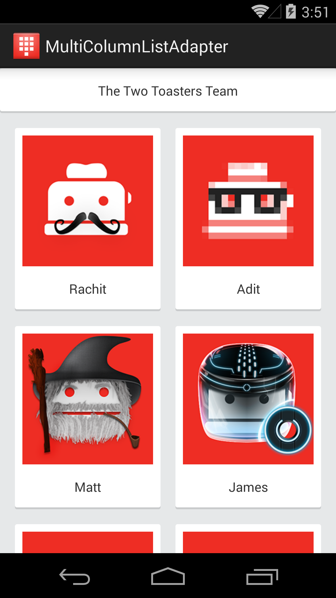

# multi-column-list-adapter  &nbsp;&nbsp; [](https://travis-ci.org/twotoasters/multi-column-list-adapter)

MultiColumnListAdapter is a cursor adapter that enables you to make a ListView that looks like a GridView. One important benefit is that you can add headers and footers to your grid-looking list.



## Sample App

The sample app demonstrates how to use the MultiColumnListAdapter to create a GridView-looking layout with a header. You can build it from source or install it from the [Play Store](https://play.google.com/store/apps/details?id=com.twotoasters.multicolumnlistadapter.sample).

## Download

Grab the library from Maven central

```xml
<dependency>
    <groupId>com.twotoasters.multicolumnlistadapter</groupId>
    <artifactId>library</artifactId>
    <version>1.0.0</version>
</dependency>
```

or Gradle:

```groovy
compile 'com.twotoasters.multilinecursoradapter:library:1.0.+'
```

## Credit

MultiColumnListAdapter was created by [Two Toasters](@twotoasters) in development with [Ebates](http://www.ebates.com).

## License

    Copyright 2014 Two Toasters

    Licensed under the Apache License, Version 2.0 (the "License");
    you may not use this file except in compliance with the License.
    You may obtain a copy of the License at

       http://www.apache.org/licenses/LICENSE-2.0

    Unless required by applicable law or agreed to in writing, software
    distributed under the License is distributed on an "AS IS" BASIS,
    WITHOUT WARRANTIES OR CONDITIONS OF ANY KIND, either express or implied.
    See the License for the specific language governing permissions and
    limitations under the License.
